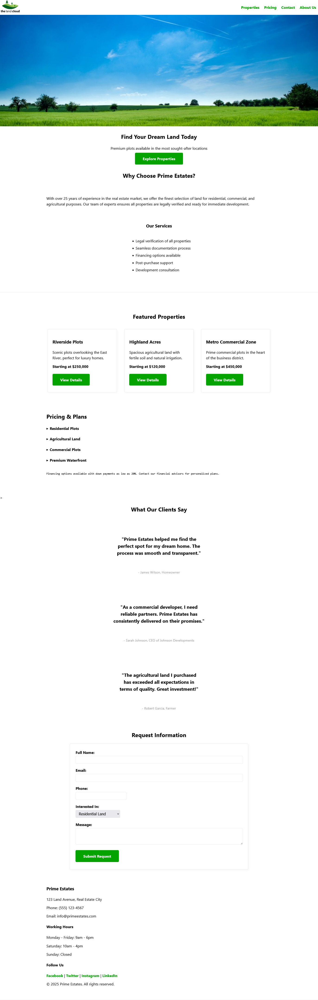

# 🏡 Prime Estates Landing Page — MVP.css

This is a **responsive landing page prototype** for a real estate platform called **Prime Estates**, built entirely with **[MVP.css](https://andybrewer.github.io/mvp/)** — `🟡 a classless, minimal, and elegant CSS framework.`

---

## 🎯 About MVP.css

**MVP.css** is a lightweight CSS library that styles semantic HTML5 elements beautifully — with **zero class names** required. It's ideal for prototypes, quick pages, and clean, accessible web design.

It automatically styles your:

- Layouts
- Buttons
- Forms
- Navigation
- Quotes
- Tables
- Dialogs
- And much more!

---

## 🖼️ Landing Page Preview

Here’s a preview of the Prime Estates landing page built with MVP.css:



---

## 🧩 Elements Supported by MVP.css

MVP.css works with the following HTML elements:

```html
<a> — text links
    <a><b>, <a><strong> — solid link buttons
    <a><em>, <a><i> — outlined link buttons
<article> — content area with normal styling
    <article><aside> — text callout
<blockquote> — quote callout
    <blockquote><footer> — quote attribution
<body> — default parent element
<button> — form buttons
<code> — inline code highlighting
<details> — default expandable content section
    <details><summary> — expandable heading
<dialog> — popup windows
<div> — unstyled element
<figure> — image callouts
    <figure><figcaption> — image callout captions
<footer> — footer area
<form> — small form area
    <form><input> — short input field
    <form><label> — form field labels
    <form><select> — dropdown options container
        <form><select><option> — dropdown option items
    <form><textarea> — large input field
<header> — content area with centered styling
<h1>, <h2>, <h3>, <h4>, <h5>, <h6> — headings
<hr> — horizontal rule (divider)
<main> — main content area
<mark> — text highlighting
<nav> — top navigation
    <nav><ul> — nav links container
    <nav><ul><li> — nav link items
    <nav><ul><li><ul> — nav dropdown container
    <nav><ul><li><ul><li> — nav dropdown link items
<ol> — numbered list container
    <ol><li> — numbered list items
<p> — paragraph tag
<pre> — preformatted text
    <pre><code> — code block
    <pre><samp> — computer output block
<samp> — inline computer output
<section> — content area for centered / special content
    <section><aside> — content card
<small> — smaller text
<sup> — raised text (notification bubbles)
<table> — data table
    <table><td> — data table cell
    <table><th> — data table header cell
    <table><thead> — data table header section
    <table><tr> — data table row
<ul> — unordered list container
    <ul><li> — unordered list item
